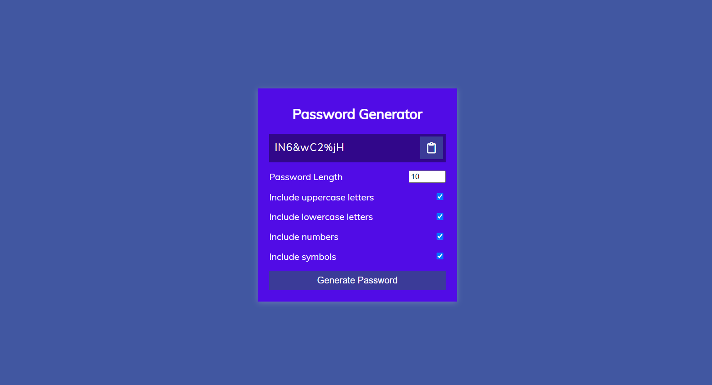

# Password Generator

This project is a simple and effective password generator that allows users to create secure passwords with customizable options. The generator includes features such as specifying password length and including uppercase letters, lowercase letters, numbers, and symbols.



## Table of Contents

- [Demo](#demo)
- [Features](#features)
- [Technologies Used](#technologies-used)
- [Getting Started](#getting-started)
- [Usage](#usage)
- [Contributing](#contributing)

## Demo

Try the live demo: [Password Generator](https://password-generator-web.s3.ap-south-1.amazonaws.com/index.html)

## Features

- **Password Length**: Set the length of the password (4-20 characters).
- **Uppercase Letters**: Option to include uppercase letters.
- **Lowercase Letters**: Option to include lowercase letters.
- **Numbers**: Option to include numbers.
- **Symbols**: Option to include symbols.
- **Clipboard Copy**: Copy the generated password to the clipboard with a single click.

## Technologies Used

- **HTML**: Structure of the web page.
- **CSS**: Styling the web page.
- **JavaScript**: Logic for generating the password and handling user interactions.

## Getting Started

### Prerequisites

To run this project locally, you need a modern web browser.

### Installation

1. **Clone the repository:**
   ```bash
   git clone https://github.com/Schwarz18/passwordGenerator.git
   cd passwordGenerator
   ```

2. **Open `index.html` in your browser:**
   Simply double-click the `index.html` file or open it in your preferred web browser.

## Usage

1. **Set Password Options:**
   - Use the checkboxes to include or exclude uppercase letters, lowercase letters, numbers, and symbols.
   - Set the desired password length using the input field.

2. **Generate Password:**
   - Click the "Generate Password" button to create a new password based on the selected options.

3. **Copy to Clipboard:**
   - Click the clipboard icon to copy the generated password to your clipboard.

## Contributing

Contributions are welcome! Please open an issue or submit a pull request for any improvements or bug fixes.

## Contact

For any questions or support, please contact [sudeephm774@gmail.com](mailto:sudeephm774@gmail.com).

---
